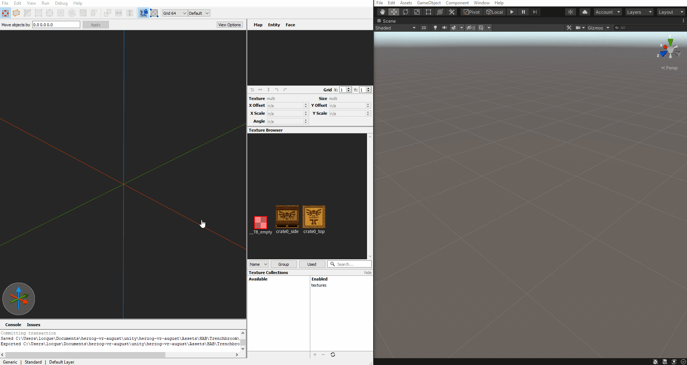

# TrenchBroom for Unity

## Features
- Decimal grid sizes
- Streamlined exporting as wavefront object

## Releases
- Binary builds are available from [releases](https://github.com/locque/TrenchBroom/releases).
